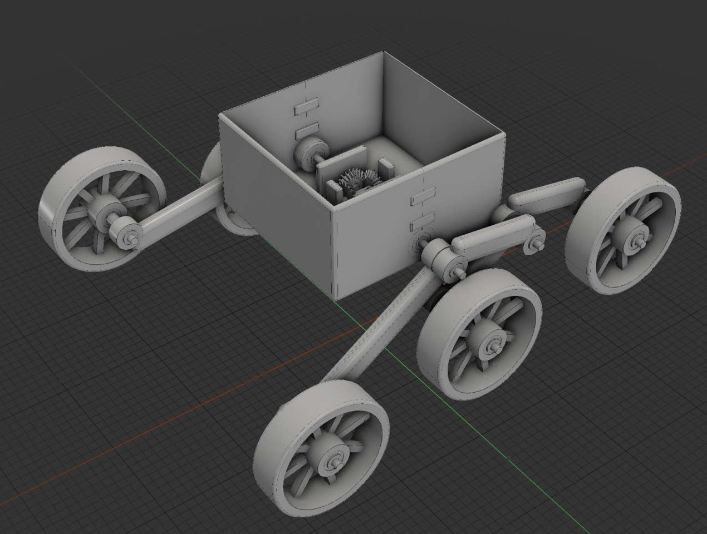

# YapRover

YapRover is an open, conventionally printable rocker-bogie rover designed
with the [yapCAD](https://github.com/rdevaul/yapCAD) procedural CAD system.
It is both a practical rover project and an integration showcase for yapCAD's
DSL, analytic BREP modeling, annotated assembly datums, mate solving,
mechanical joint coupling, manufacturing metadata, and `.ycpkg` packages.



The design is currently a pre-alpha engineering prototype. Geometry and
kinematics are under active validation and must not yet be treated as a
production-ready mechanical design.

## How rocker-bogie works

For a quick visual introduction, see this short
[rocker-bogie suspension and drive explanation](https://www.youtube.com/shorts/hO8DbfE7hJw).
The [rocker-bogie overview on Wikipedia](https://en.wikipedia.org/wiki/Rocker-bogie)
provides additional history, terminology, and diagrams. YapRover uses the same
six-wheel rocker-and-bogie topology and a differential linkage that couples
the left and right rockers; its optional wheel-drive system is still a future
design study rather than part of the passive first prototype.

## Repository layout

- `designs/` contains the yapCAD DSL source of record.
- `src/yaprover/` contains rover-specific kinematic and validation tools.
- `tests/` verifies the numerical oracle, mate-solved assembly, analytic
  geometry, and mechanical clearances.
- `docs/` will contain fabrication and assembly documentation.
- `bom/` and `manufacturing/` will contain sourcing and fabrication data.
- `releases/` is reserved for versioned `.ycpkg` design releases.

## Development environment

OpenCASCADE is required for the authoritative analytic geometry tests. Create
the supported conda environment and install this checkout:

```bash
conda env create -f environment.yml
conda activate yaprover
python -m pip install -e '.[test]'
```

Run the normal test suite:

```bash
pytest -m "not visual and not expensive_geometry"
```

Run the slower exact-geometry tests explicitly:

```bash
pytest -m "expensive_geometry and not visual"
```

## Generate the rover package

Build the level-pose rover as a validated assembly-aware `.ycpkg` from the
repository root:

```bash
python tools/build_ycpkg.py
```

The output is the directory `build/yaprover-0.1.0.ycpkg/`. A `.ycpkg` is a
directory package, not a single STEP file. It contains the `ycpkg-spec-v0.2`
manifest, solved instances and mate/coupling graph, generated BOM, original DSL
source, and `yapcad-geometry-json-v0.2` geometry with embedded analytic BREP.
Expect the current package to occupy roughly 190 MB.

Select another version or preview pose, or replace an existing build, with:

```bash
python tools/build_ycpkg.py --version 0.1.1 \
  --rocker-angle-deg 12 --force
```

Use `--output path/to/name.ycpkg` to choose another destination. Package
generation requires the OpenCASCADE-enabled `yaprover` conda environment and
the editable installation described above. The builder runs strict package
validation before reporting success.

The generated BOM now distinguishes printed `make` parts, purchased `buy`
hardware, and `raw_stock` cut-to-length shafts, keys, and spacer tube. These
classes also drive the viewer's fabricated, COTS, and raw-stock visibility and
rendering styles. Procurement details are still preliminary, so do not use the
BOM for purchasing without checking the source specifications.

Until yapCAD publishes the next release, `pyproject.toml` pins the exact
upstream commit containing the assembly, coupling, bevel-gear, and packaging
features required by this design. It will be replaced by a released version
constraint once that release is available.

The current [differential cartridge design](docs/differential.md) uses four
spherical-involute miter gears. Its two planet gears are separate parts with
independent running joints on a retained shoulder pin. Integral thrust hubs
and low-friction washers control axial float without clamping the planets, and
the four-fastener cradle is removable from the chassis. Exact BREP tests verify
pin and thrust clearances plus all four meshes through a complete tooth pitch.

The [suspension geometry and ROM notes](docs/suspension.md) document the
single-band split rocker, adjacent bogie layer, recessed axle retention, and
the broad-phase plus exact-BREP range-of-motion acceptance test.

An optional [powered-wheel candidate study](docs/drive_candidates.md) defines
a motor envelope, split-clamp mount, coupler, rotating axle, and suspension-side
dual-bearing cartridge. It is deliberately excluded from the passive first-build
package until prototype mass and traction measurements justify a motor choice.

## License

YapRover is licensed under the MIT License. See [LICENSE](LICENSE).
